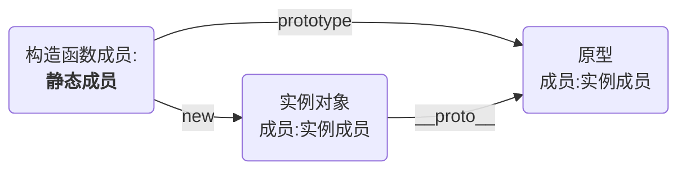

# 类的其他书写方式

## 可计算的成员名

```js
const printName = "print";//可计算的成员名

class Animal {
    constructor(type, name, age, sex) {
        this.type = type;
        this.name = name;
        this.age = age;
        this.sex = sex;
    }

    [printName]() {
        console.log(`【种类】：${this.type}`);
        console.log(`【名字】：${this.name}`);
        console.log(`【年龄】：${this.age}`);
        console.log(`【性别】：${this.sex}`);
    }
}

const a = new Animal("狗", "旺财", 3, "男");
a[printName]();
```

## getter和setter

Object.defineProperty 可定义某个对象成员属性的读取和设置

使用getter和setter控制的属性，不在原型上

```js
const printName = "print";

class Animal {
    constructor(type, name, age, sex) {
        this.type = type;
        this.name = name;
        this.age = age;
        // 旧写法
        // Object.defineProperty(this,"age",{
        //     set(value){
        //         this._age = value;
        //     },
        //     get(){
        //         return this._age;
        //     }
        // })
        this.sex = sex;
    }

    //创建一个age属性，并给它加上getter，读取该属性时，会运行该函数
    get age() {
        return this._age + "岁";
    }

    //创建一个age属性，并给它加上setter，给该属性赋值时，会运行该函数
    set age(value) {
        if (typeof value !== "number") {
            throw new TypeError("age property must be a number");
        }
        if (value < 0) {
            value = 0;
        }
        else if (value > 1000) {
            value = 1000;
        }
        this._age = value;
    }

    [printName]() {
        console.log(`【种类】：${this.type}`);
        console.log(`【名字】：${this.name}`);
        console.log(`【年龄】：${this.age}`);
        console.log(`【性别】：${this.sex}`);
    }
}

var a = new Animal("狗", "旺财", 3, "男");

```

## 静态成员

构造函数本身的成员

使用static关键字定义的成员即静态成员



```js
class Chess {
    constructor(name) {
        this.name = name;
    }

    static width = 50;

    static height = 50;

    static method() {

    }
}

console.log(Chess.width)
console.log(Chess.height)

Chess.method();
```

## 字段初始化器（ES7）

注意：

1). 使用static的字段初始化器，添加的是静态成员
2). 没有使用static的字段初始化器，添加的成员位于对象上
3). 箭头函数在字段初始化器位置上，指向当前对象

```js
class Test {
    static a = 1;
    b = 2;
    c = 3;

    constructor() {
        //this.b = b
        //this.c = c
        this.d = this.b + this.c;
    }
}

const t = new Test();
console.log(t)
```

## 类表达式

## 装饰器（ES7）(Decorator)

横切关注点

装饰器的本质是一个函数

```js
class Test {

    @Obsolete
    print() {
        console.log("print方法")
    }
}

function Obsolete(target, methodName, descriptor) {
    // function Test
    // print
    // { value: function print(){}, ... }
    // console.log(target, methodName, descriptor);
    const oldFunc = descriptor.value
    descriptor.value = function (...args) {
        console.warn(`${methodName}方法已过时`);
        oldFunc.apply(this, args);
    }
}
```
