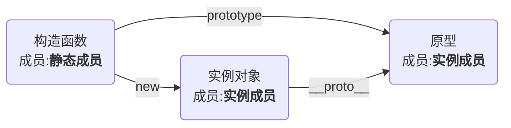

## 面向对象简介

面向对象：一种编程思想

### 示例【大象装冰箱】

#### 面向过程：思考的切入点是功能的步骤

```js
// 1. 冰箱门打开
function openFreezer() {

}
openFreezer();

// 2. 大象装进去
function elephantIn() {

}

elephantIn();

// 3. 冰箱门关上
function closeFreezer() {

}

closeFreezer();
```

#### 面向对象：思考的切入点是对象的划分

```js
/**
 * 大象
 */
function Elephant() {

}

/**
 * 冰箱
 */
function Freezer() {

}

Freezer.prototype.openDoor = function () {

}

Freezer.prototype.closeDoor = function () {

}

Freezer.prototype.join = function(something) {
    this.openDoor();
    // 装东西

    something

    this.closeDoor();
}

// 1. 冰箱门打开
// var frig = new Freezer();
// frig.openDoor();

// //2. 大象装进去
// var ele = new Elephant();
// frig.join(ele);

// //3. 冰箱门关上
// frig.closeDoor();

var frig = new Freezer();

frig.join(new Elephant());
```

## 类：构造函数的语法糖

传统的构造函数的问题

1. 属性和原型方法定义分离，降低了可读性
2. 原型成员可以被枚举
3. 默认情况下，构造函数仍然可以被当作普通函数使用

### 语法

```js
class xx {
    constructor(xxx) {
        this.xxx = xxx;
    }

    xxxxFunction() {
        console.log(`xxx`);
    }
}

new xx
```

### 示例

#### class写法

```js
class Animal {
    constructor(type, name, age, sex) {
        this.type = type;
        this.name = name;
        this.age = age;
        this.sex = sex;
    }

    print() {
        console.log(`【种类】：${this.type}`);
        console.log(`【名字】：${this.name}`);
        console.log(`【年龄】：${this.age}`);
        console.log(`【性别】：${this.sex}`);
    }
}

const a = new Animal("狗", "旺财", 3, "男");
a.print();

for (const prop in a) {
    console.log(prop)
}
```

#### 原写法

```js
// 构造函数  构造器
function Animal(type, name, age, sex) {
    this.type = type;
    this.name = name;
    this.age = age;
    this.sex = sex;
}

// 定义实例方法（原型方法）
Animal.prototype.print = function () {
    console.log(`【种类】：${this.type}`);
    console.log(`【名字】：${this.name}`);
    console.log(`【年龄】：${this.age}`);
    console.log(`【性别】：${this.sex}`);
}

const a = new Animal("狗", "旺财", 3, "男");
a.print();

for (const prop in a) {
    console.log(prop)
}
```

### 细节

#### 类的特点

1. 类声明不会被提升，与 let 和 const 一样，存在暂时性死区
2. 类中的所有代码均在严格模式下执行
3. 类的所有方法都是不可枚举的
4. 类的所有方法都无法被当作构造函数使用
5. 类的构造器必须使用 new 来调用

## 类的扩展

### 可计算的成员名

使用示例

```js
const printName = "print";// 可计算的成员名

class Animal {
    constructor(type, name, age, sex) {
        this.type = type;
        this.name = name;
        this.age = age;
        this.sex = sex;
    }

    [ printName ]() {
        console.log(`【种类】：${this.type}`);
        console.log(`【名字】：${this.name}`);
        console.log(`【年龄】：${this.age}`);
        console.log(`【性别】：${this.sex}`);
    }
}

const a = new Animal("狗", "旺财", 3, "男");
a[ printName ]();
```

### getter和setter

`Object.defineProperty` 可定义某个对象成员属性的读取和设置

使用`getter`和`setter`控制的属性，不在原型上

使用示例

```js
const printName = "print";

class Animal {
    constructor(type, name, age, sex) {
        this.type = type;
        this.name = name;
        this.age = age;
        // 旧写法
        // Object.defineProperty(this,"age",{
        //     set(value){
        //         this._age = value;
        //     },
        //     get(){
        //         return this._age;
        //     }
        // })
        this.sex = sex;
    }

    // 创建一个age属性，并给它加上getter，读取该属性时，会运行该函数
    get age() {
        return this._age + "岁";
    }

    // 创建一个age属性，并给它加上setter，给该属性赋值时，会运行该函数
    set age(value) {
        if (typeof value !== "number") {
            throw new TypeError("age property must be a number");
        }
        if (value < 0) {
            value = 0;
        }
        else if (value > 1000) {
            value = 1000;
        }
        this._age = value;
    }

    [ printName ]() {
        console.log(`【种类】：${this.type}`);
        console.log(`【名字】：${this.name}`);
        console.log(`【年龄】：${this.age}`);
        console.log(`【性别】：${this.sex}`);
    }
}

new Animal("狗", "旺财", 3, "男");

```

### 静态成员

构造函数本身的成员

使用`static`关键字定义的成员即静态成员



```js
class Chess {
    constructor(name) {
        this.name = name;
    }

    static width = 50;

    static height = 50;

    static method() {

    }
}

console.log(Chess.width)
console.log(Chess.height)

Chess.method();
```

### 字段初始化器（ES7）

注意：

1. 使用static的字段初始化器，添加的是静态成员
2. 没有使用static的字段初始化器，添加的成员位于对象上
3. 箭头函数在字段初始化器位置上，指向当前对象

```js
class Test {
    static a = 1;
    b = 2;
    c = 3;

    constructor() {
        // this.b = b
        // this.c = c
        this.d = this.b + this.c;
    }
}

const t = new Test();
console.log(t)
```

### 装饰器（ES7）(Decorator)

横切关注点

装饰器的本质是一个函数

```ts
class Test {
    
    // @Obsolete 当前Js还不支持,正常使用报错,需要借助Babel 或 TypeScript 进行编译
    print() {
        console.log("print方法")
    }
}

function Obsolete(target, methodName, descriptor) {
    // function Test
    // print
    // { value: function print(){}, ... }
    // console.log(target, methodName, descriptor);
    const oldFunc = descriptor.value
    descriptor.value = function (...args) {
        console.warn(`${methodName}方法已过时`);
        oldFunc.apply(this, args);
    }
}

new Test()
Obsolete
```
